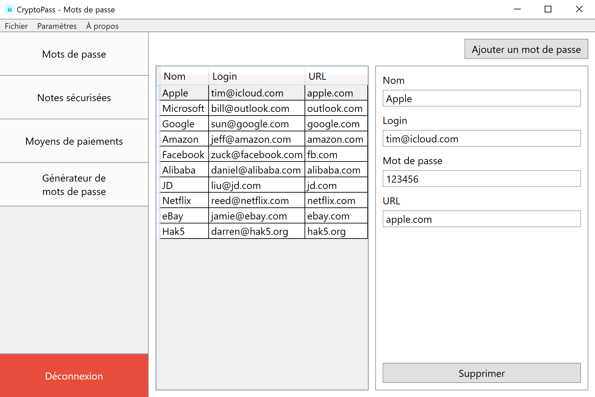
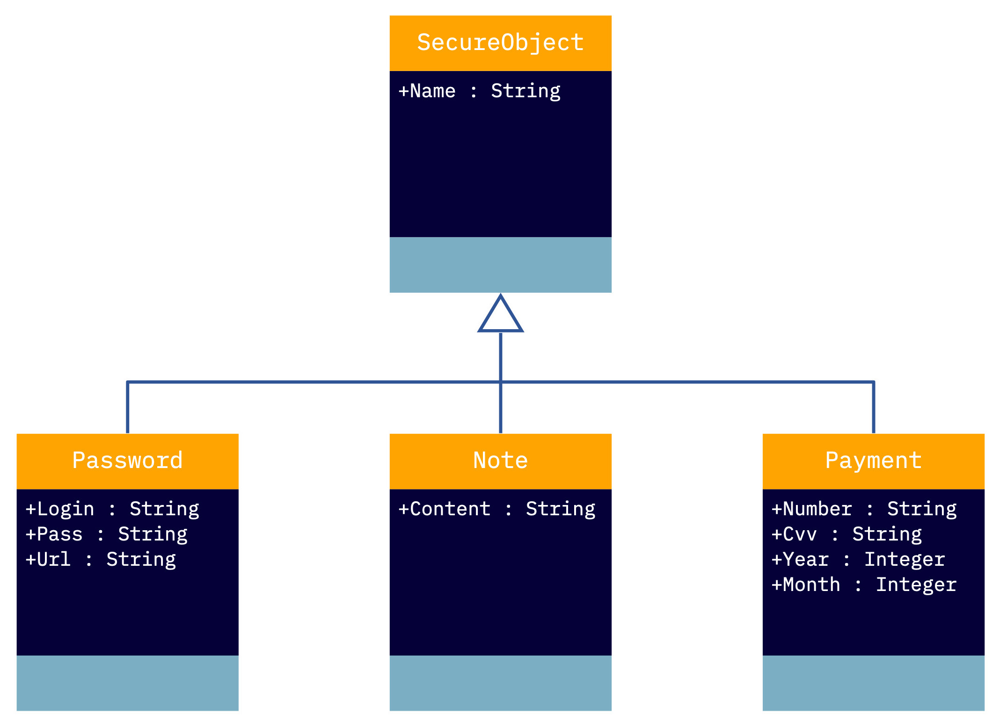

# Projet C# 2022 - CryptoPass

__Bienvenue dans la documentation du projet C# 2022 !__

Ce projet a été réalisé dans le cadre du cours de **Programmation orientée objet Windows- C#** en Bloc 2 en Informatique de gestion à l'INPRES.

CryptoPass est une application de gestion de vos mots de passe, notes sécurisées et moyens de paiements.

## Consignes du projet

__[:page_facing_up: Énoncé du projet](./Ressources/enonce.pdf)__

## Organisation du projet

* __[:package: Compile/](./Compile/)__

  Script de génération du setup d'installation du projet.

* __[:framed_picture: Images/](Images/)__

  Images présentent dans cette documentation.

* __[:pencil2: Mockup/](./Mockup/)__

  Prototypes de l'interface utilisateur.

* __[:volcano: Ressources/](./Ressources/)__

  Ressources utiles au développement du projet.

## Architecture MVVM

* __[:books: Models/](./Models/)__

  * __[:page_facing_up: SecureObject](./Models/SecureObject.cs)__

    Classe abstraite contenant la définition minimale que tous les objets sécurisés vont acquérir.

    

    * __[:page_facing_up: Password](./Models/Password.cs)__

      Classe qui hérite de __SecureObject__.
      Elle contient la définition d'un mot de passe.

    * __[:page_facing_up: Note](./Models/Note.cs)__

      Classe qui hérite de __SecureObject__.
      Elle contient la définition d'une note sécurisée.

    * __[:page_facing_up: Payment](./Models/Payment.cs)__

      Classe qui hérite de __SecureObject__.
      Elle contient la définition d'un moyen de paiement.

  * __[:page_facing_up: Generate](./Models/Generate.cs)__

    Classe génératrice de mots de passe aléatoires.

* __[:books: ViewModels/](./ViewModels/)__

  * __[:page_facing_up: AppSettings](./ViewModels/AppSettings.cs)__

    Classe statique de gestion des paramètres de l'application.

  * __[:page_facing_up: BaseViewModel](./ViewModels/BaseViewModel.cs)__

    Classe abstraite implémentant l'interface `INotifyPropertyChanged`.

  * __[:page_facing_up: DelegateCommand](./ViewModels/DelegateCommand.cs)__

    Classe implémentant l'interface `ICommand`.
    Elle permet l'appel de commande depuis le code XAML.

  * __[:page_facing_up: IManageSecureObject](./ViewModels/IManageSecureObject.cs)__

    Interface de gestion d'un objet sécurisé.

* __[:books: Views/](./Views/)__

  * __[:page_facing_up: AboutView](./Views/AboutView.xaml)__

    Fenêtre d'information.

  * __[:page_facing_up: DashboardView](./Views/DashboardView.xaml)__

    Fenêtre principale de gestion des données.

  * __[:page_facing_up: LoginView](./Views/LoginView.xaml)__

    Fenêtre de connexion.

  * __[:page_facing_up: SettingsView](./Views/SettingsView.xaml)__

    Fenêtre de gestion des paramètres.

  * __[:page_facing_up: WelcomeView](./Views/WelcomeView.xaml)__

    Fenêtre de bienvenue et de configuration du mot de passe.
